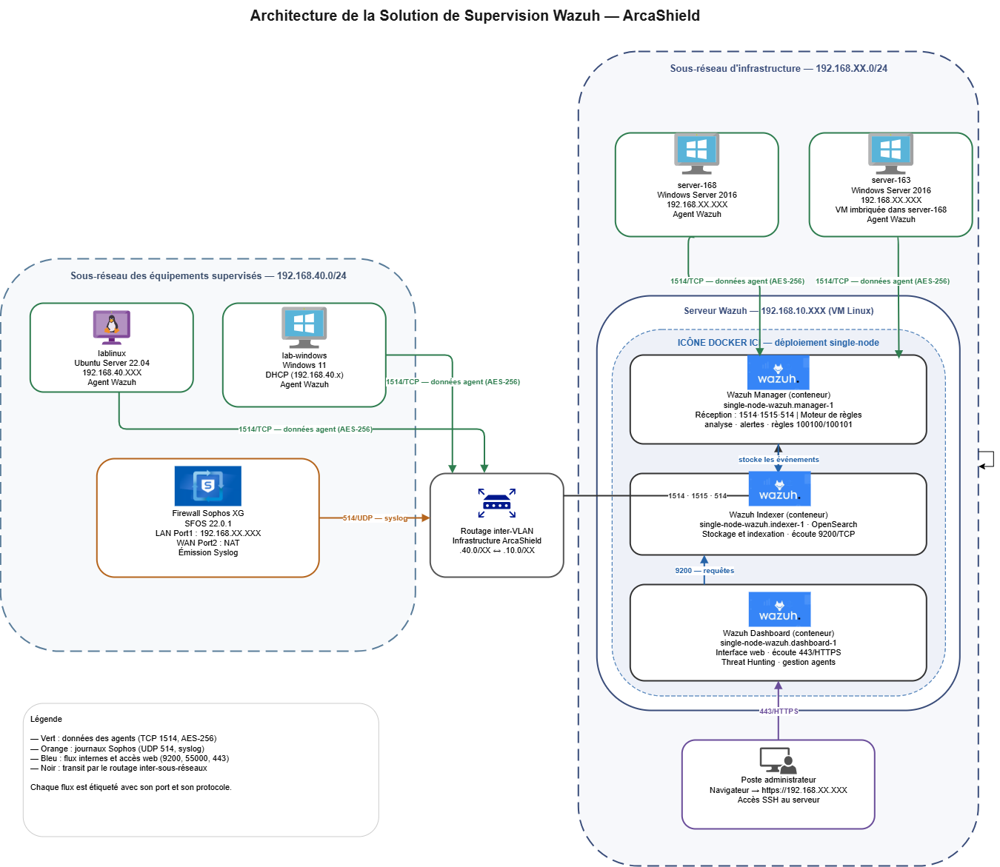

# 🛡️ Wazuh SIEM — Detection Engineering

**A security monitoring platform on Wazuh (SIEM/XDR) — custom detection rules, documented methodology, and MITRE ATT&CK mapping.**

> [!NOTE]
> **Sanitized portfolio version.** All IPs, hostnames, credentials, and serials are masked with `XXX`. No real infrastructure details are exposed.

---

## 📋 Purpose

These resources document a repeatable detection-engineering workflow:

- 🔧 Build and tune detection content in Wazuh and supporting tools
- 🎯 Illustrate detection coverage — and highlight gaps as goals to fill
- 🧩 Add or refine layers of coverage based on the environment's real needs
- 📑 Ensure proper logs are generated for detection, investigation, and compliance

---

## 🗺️ Architecture

Two subnets: an **infrastructure** subnet hosting the Wazuh server (manager, indexer, dashboard as Docker containers) and two Windows Server 2016 production endpoints; and a **lab** subnet with test endpoints and a Sophos XG firewall. Agents ship logs to the manager over encrypted TCP `1514`; the manager decodes, runs rules, and alerts are stored in the indexer and shown in the dashboard.

---

## ⚙️ Preparation & Prerequisites

> Without covering the basics, there isn't much point in having a SIEM. Harden the environment and configure appropriate auditing first.

| Resource | Description |
|---|---|
| [Preparation](docs/preparation.md) | Platform health checks and prerequisites |
| [Logging](logging/telemetry.md) | What logs are collected and how |
| [Notable Event IDs](logging/notable-event-ids.md) | Key Windows/Linux events used for detection |
| [Windows Logon Types](logging/windows-logon-types.md) | Reference: type 2 / 3 / 5 / 10 |

---

## 🔒 Hardening — endpoint audit configuration

> Detection is only as good as the telemetry. These document the auditing enabled so the right events are generated.

| Resource | Description |
|---|---|
| [Microsoft Windows](hardening/microsoft-windows.md) | Sysmon · PowerShell Script Block Logging · audit policy (4624/4625/4688/4672) |
| [Linux](hardening/linux.md) | auth.log · auditd system-call monitoring |
| [Network / Firewall](hardening/network.md) | Sophos XG syslog integration |

---

## 🎯 Detection & Compliance Matrix

> Mapping detections to attacker techniques, log sources, and coverage gaps — the core of showing *what* is detected and *what isn't yet*.

| Resource | Description |
|---|---|
| [MITRE ATT&CK Coverage](matrix/mitre-coverage.md) | Techniques detected, mapped to [MITRE ATT&CK](https://attack.mitre.org/), with gaps |
| [Detection Methods](docs/detection-methods.md) | How each rule reveals malicious activity |
| [Signature Structure](docs/signature-structure.md) | How custom rules are written in `local_rules.xml` |
| [Rules](rules/local_rules.xml) | The custom detection rules themselves |

---

## 📊 Baseline & Observation

> Before writing rules, normal activity is characterized so deviations stand out.

**Key principle:** detection is knowing *normal* so precisely that *abnormal* becomes obvious. A rule expresses a deviation from a measured baseline — and the precision lives in the log **fields**, not the event name. The same failed-logon event is benign service noise (`logon type 5`) or a real attack (`type 3` / `10`) depending on the fields.

➡️ [Server Baseline](baseline/server-baseline.md) — ranked normal activity, field-level analysis, and inherited built-in coverage

---

## 🧪 Lab

> A Windows endpoint, the SIEM, and an attacking system — used to safely develop and validate rules without touching production.

➡️ [Lab Setup](lab/lab-setup.md) — the attack range and rule-validation workflow

---

## 🧰 Tech Stack

`Wazuh 4.14.x` · `Docker` · `Windows Server 2016` · `Ubuntu Server 22.04` · `Sysmon` · `auditd` · `Sophos XG` · `MITRE ATT&CK`

---

Work in progress — detection use cases are added and documented as they are built.

